# DriveGuard

> An Android driving-behaviour monitoring application built with Kotlin, Jetpack Compose, Room, GPS and device-motion sensors.

[](https://kotlinlang.org/)
[](https://developer.android.com/compose)
[](https://developer.android.com/training/data-storage/room)
[](LICENSE)

DriveGuard records journey data locally, detects potentially unsafe driving events through deterministic sensor rules, calculates a weighted safety score, and lets a driver review saved trips, incidents and route points. The current implementation is a privacy-first educational Android project: it does not upload journey data to a server and does not make insurance or road-safety decisions.

## What it demonstrates

- Native Android development with Kotlin and Jetpack Compose
- GPS speed and route-point collection with Android location APIs
- Accelerometer and gyroscope event processing
- Rule-based detection of speeding, harsh braking, sudden acceleration and sharp turns
- A weighted 0-100 driver-safety score
- Local relational persistence with Room and SQLite
- Reactive state handling with `StateFlow`
- Foreground-service lifecycle and notification handling
- Unit-testable business rules separated from the UI layer

## Application flow

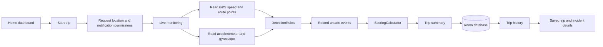

## Architecture

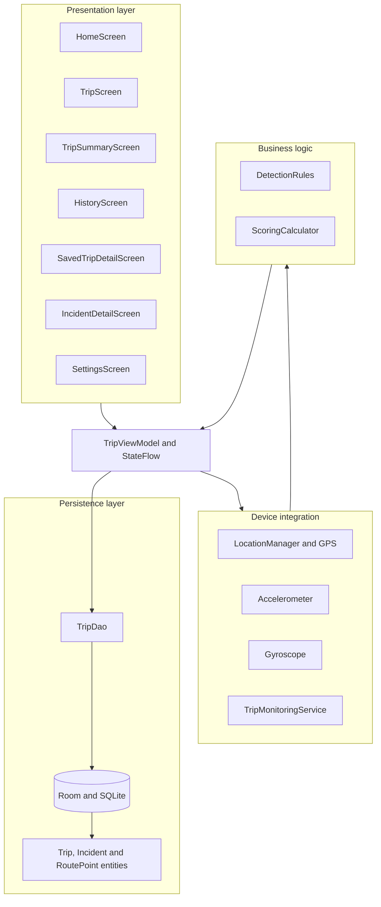

## Detection and scoring workflow

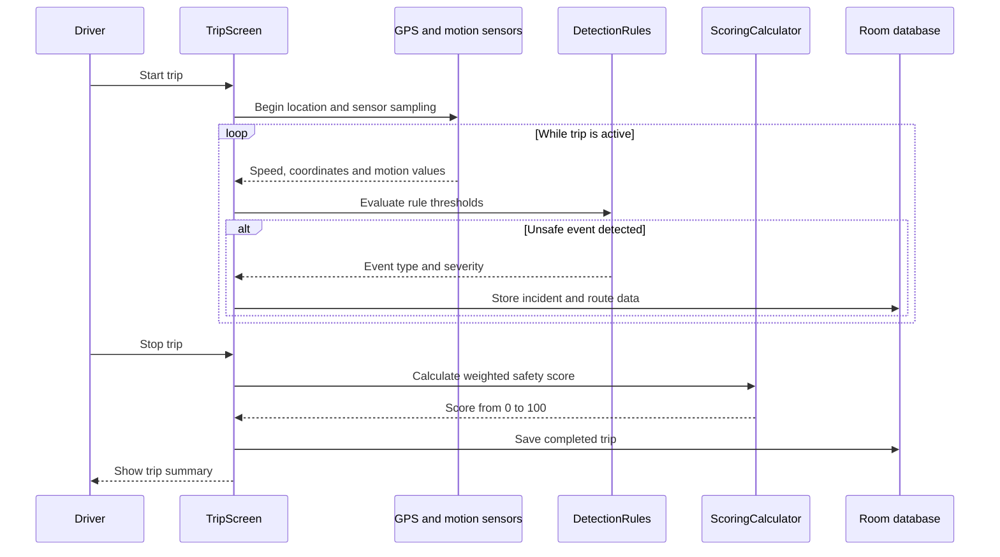

### Current rule thresholds

| Event | Rule in the published source | Score penalty |
|---|---:|---:|
| Speeding | Speed above 30 mph | -5 |
| Sudden acceleration | Acceleration above `12 m/s²` | -7 |
| Sharp turn | Absolute gyroscope value above `3` | -8 |
| Harsh braking | Acceleration below `-12 m/s²` | -10 |

Sensor-based incidents are only logged when the device has a valid location and the calculated speed is at least 5 mph. These values are project defaults, not validated safety or insurance standards.

## Screenshots

The gallery combines current driver-side screens with prototype/evaluation screens produced during the project. Screens marked **Prototype** illustrate planned authentication, fleet and administrator concepts; those concepts are not implemented in the published source.

### Current driver experience

| Home dashboard | Trip completed | Drive overview |
|---|---|---|
| 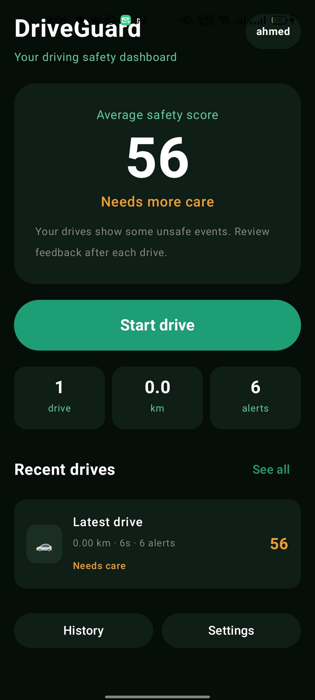 | 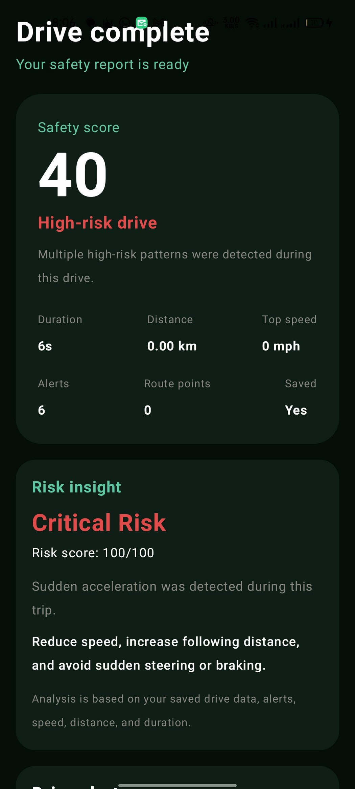 | 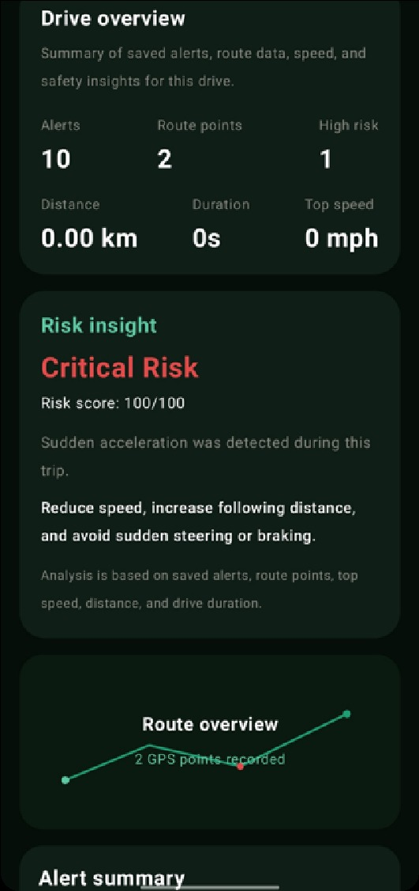 |

| Settings | Privacy controls | Recorded safety alerts |
|---|---|---|
| 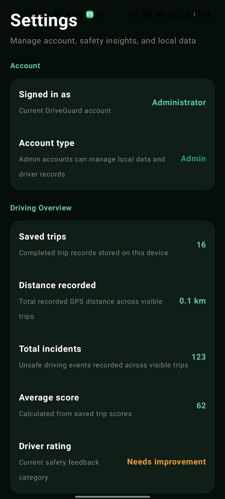 | 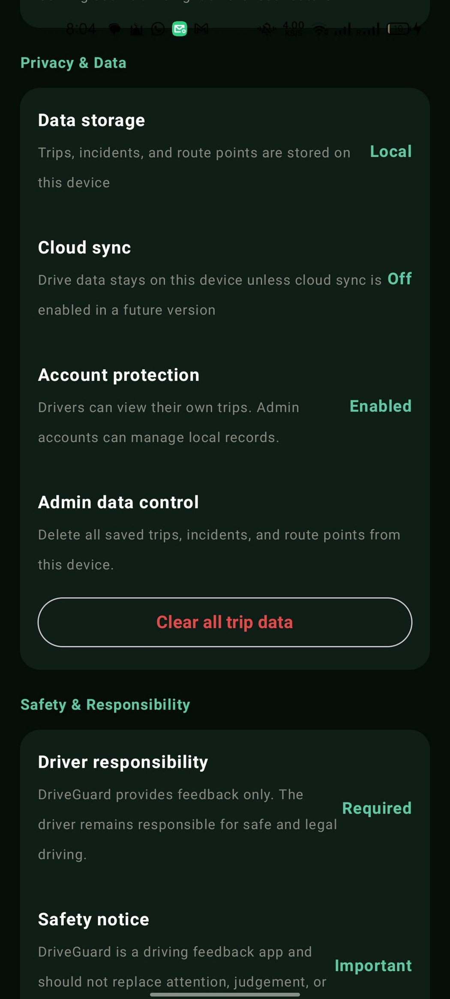 | 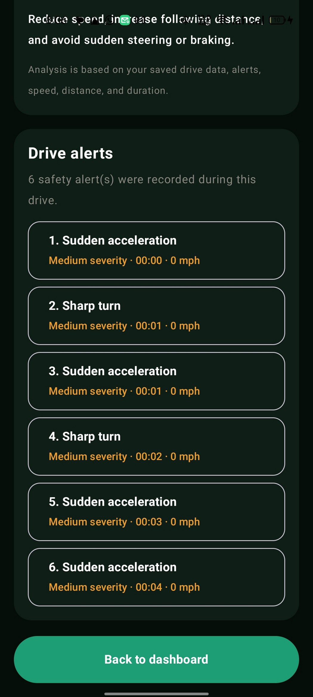 |

| Alert summary |
|---|
| 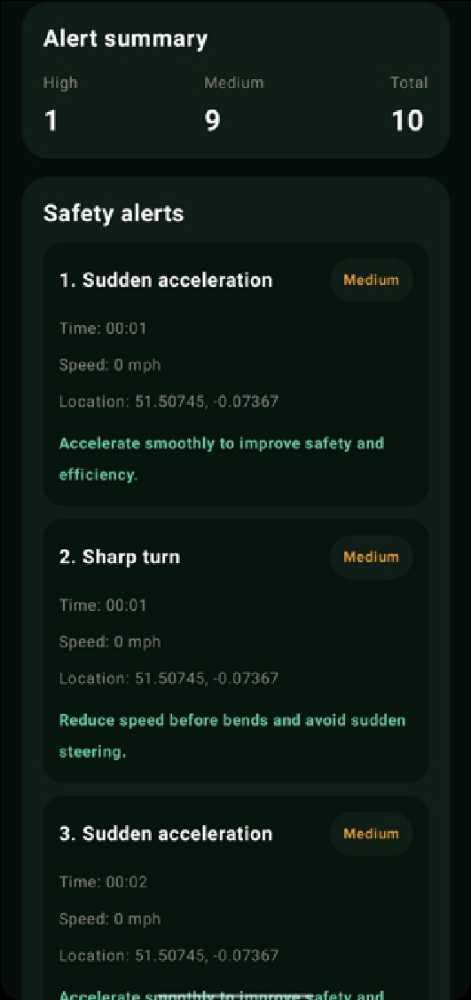 |

### Prototype and future-facing concepts

| Sign-in prototype | Administrator dashboard | Driver list |
|---|---|---|
| 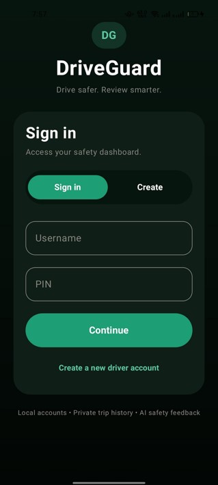 | 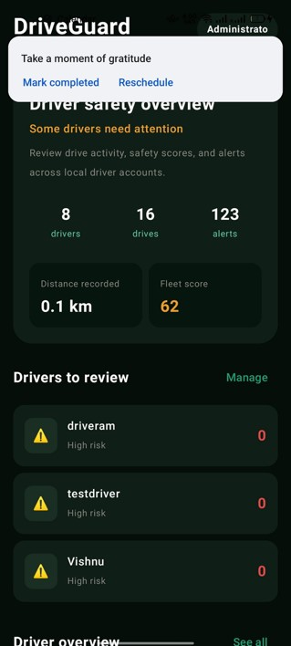 | 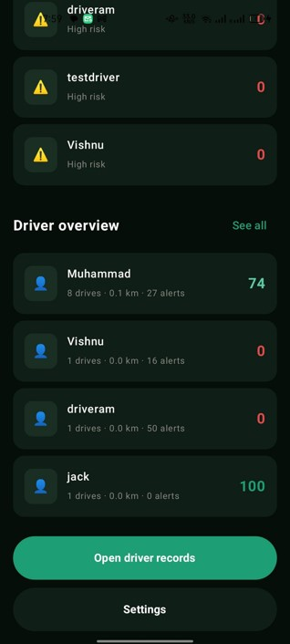 |

| Driver records | Risk configuration |
|---|---|
| 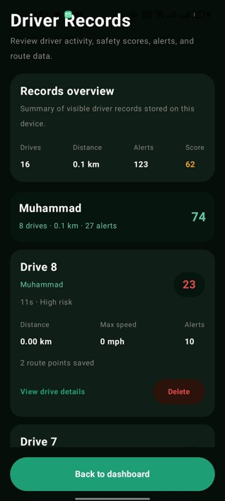 | 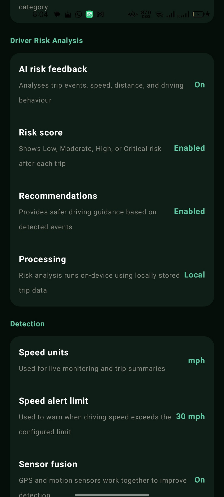 |

## Data model

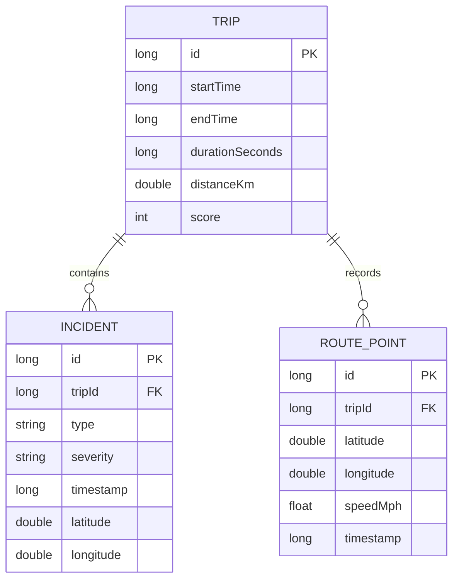

## Repository structure

```text
app/src/main/java/com/example/driveguard/
├── MainActivity.kt                 # Navigation and app entry point
├── TripScreen.kt                   # Live GPS and sensor monitoring
├── TripMonitoringService.kt        # Foreground-service notification
├── TripViewModel.kt                # Reactive trip state
├── DetectionRules.kt               # Pure detection thresholds
├── ScoringCalculator.kt            # Weighted safety score
├── HomeScreen.kt
├── TripSummaryScreen.kt
├── HistoryScreen.kt
├── SavedTripDetailScreen.kt
├── IncidentDetailScreen.kt
├── SettingsScreen.kt
├── data/
│   ├── DriveGuardDatabase.kt
│   ├── dao/TripDao.kt
│   └── entities/
└── ui/theme/
```

## Development workflow

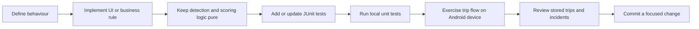

## Getting started

### Requirements

- Android Studio with a compatible JDK
- Android SDK 36
- Android 8.0 / API 26 or later
- A physical device for realistic GPS and motion-sensor testing

### Run the application

```bash
git clone https://github.com/Nawaaalae/Ai-dashcam-system.git
cd Ai-dashcam-system
./gradlew assembleDebug
```

Open the project in Android Studio, run the `app` configuration, and grant location and notification permissions when prompted. Do not interact with the application while driving.

## Testing

Local unit tests cover detection boundaries, location/movement validation, weighted scoring and score clamping:

```bash
./gradlew testDebugUnitTest
```

The tests are included in the repository for reproducibility. They were not re-run in the publishing environment because that machine did not have a Java runtime installed.

## Scope and limitations

- Detection is rule-based; the published build does not contain a trained AI or computer-vision model.
- Lane-departure and traffic-light recognition remain future concepts.
- Thresholds require wider calibration across devices, vehicles and road conditions.
- GPS and sensor behaviour should be tested across multiple physical Android devices.
- The project is not an insurance product, emergency system or substitute for attentive driving.

## Roadmap

- Move continuous sampling fully into the foreground service
- Add dependency injection and repository abstractions
- Add instrumented Room and Compose UI tests
- Add configurable thresholds with validation
- Add CI for build, lint and unit tests
- Evaluate TensorFlow Lite only after a suitable dataset and validation plan exist

## Author

**Muhammad Nawal Ahmed**

[LinkedIn](https://www.linkedin.com/in/muhammadnawalahmed) · [GitHub](https://github.com/Nawaaalae)

## License

Licensed under the [MIT License](LICENSE).
